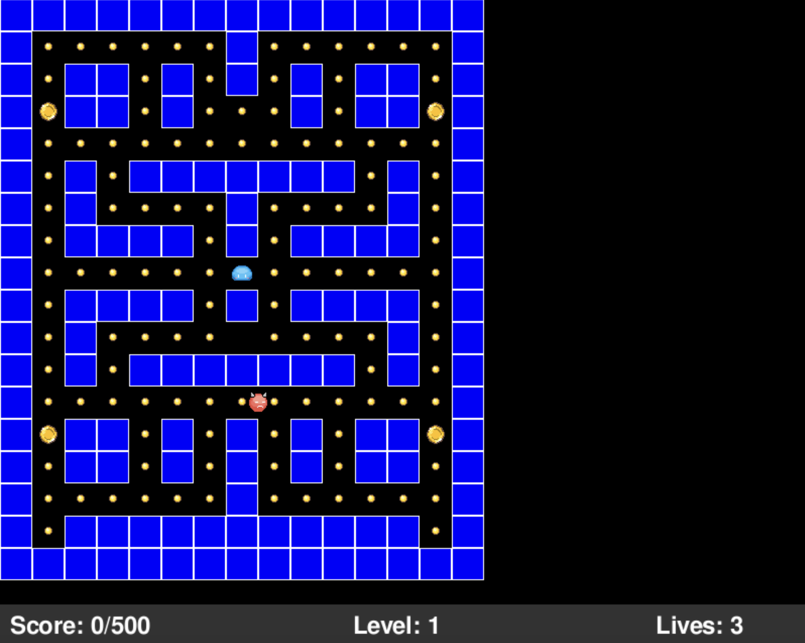
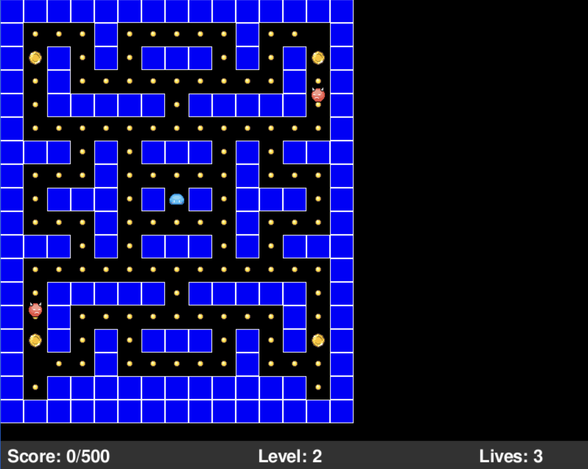
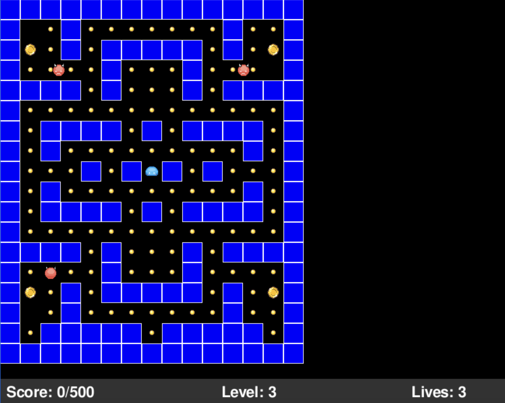
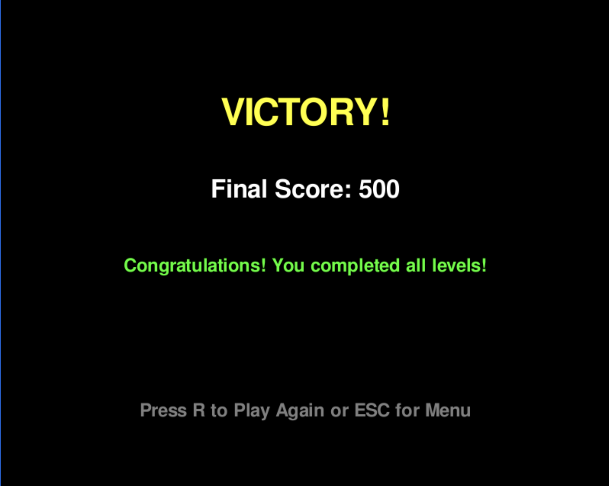

# 🎮 SlimeGobble

<div align="center">

[](https://jake-yutong.github.io/SlimeGobble/)
[](https://www.python.org/)
[](https://www.pygame.org/)
[](LICENSE)

**A Pac-Man inspired game built with Pygame, featuring 3 levels, intelligent AI enemies, frame-based animations, and complete sound effects**

[🎮 Play Now](#-play-online) • [📖 Documentation](#-project-structure) • [🚀 Local Setup](#-local-setup)

</div>

---

## 🌐 Play Online

**🎮 [Click here to play in your browser](https://jake-yutong.github.io/SlimeGobble/)**

No installation required! Works on all modern browsers (Chrome, Firefox, Safari, Edge).

---

## 🖼️ Screenshots

<div align="center">

### Level 1 - Beginner Stage


### Level 2 - Intermediate Challenge


### Level 3 - Ultimate Challenge


### Victory Screen


</div>

---

## 🚀 Local Setup

Want to run the game locally? Just three steps:

```bash
# 1. Clone the repository
git clone https://github.com/Jake-yutong/SlimeGobble.git
cd SlimeGobble

# 2. Create virtual environment and install dependencies
python3 -m venv venv
source venv/bin/activate  # Windows: venv\Scripts\activate
pip install pygame numpy

# 3. Start the game
python main.py
```

### System Requirements
- Python 3.12 or higher
- macOS / Windows / Linux
- Graphics environment supporting Pygame

## 🎯 Controls

| Key | Action |
|-----|--------|
| W | Move Up |
| A | Move Left |
| S | Move Down |
| D | Move Right |
| P | Pause/Resume |
| ESC | Return to Main Menu |

## 🎮 Gameplay

### Objective
Control the cute slime "Mumu" to collect coins and reach 500 points to advance to the next level!

### Game Elements
- 🪙 **Small Coin**: 10 points
- 💰 **Big Coin**: 50 points
- 👻 **Chaser**: Touching one costs 1 life
- ❤️ **Life System**: 3 lives total, game over when depleted

### Level Design
- **Level 1**: 2 Random enemies (random movement)
- **Level 2**: 2 Chase enemies (track player) + 1 Fast Chase (rapid tracking)
- **Level 3**: 3 Fast Chase enemies (ultimate challenge!)

## 📁 Project Structure

```
SlimeGobble/
├── 📄 Core Code
│   ├── main.py          # Game entry point (Web async support)
│   ├── game.py          # Main game logic and state management
│   ├── player.py        # Player character class (animation system)
│   ├── enemy.py         # Enemy AI system (3 behavior modes)
│   └── config.py        # Game configuration and level maps
│
├── 🎨 Game Assets
│   └── assets/          # Sprites, sounds, JSON animation files
│       ├── slime *.png/json    # Player animations (4 directions)
│       ├── Chaser *.png        # Enemy sprites (4 directions)
│       ├── coin.png, big coin.png
│       └── *.wav               # Background music and sound effects
│
├── 🚀 Deployment
│   ├── deploy_web.sh    # Automated deployment script
│   ├── build_executable.sh
│   └── WEB_DEPLOYMENT.md
│
├── 📚 Documentation
│   ├── README.md        # This file
│   ├── DEVELOPMENT.md   # Development documentation
│   ├── SUBMISSION.md    # Assignment submission guide
│   └── PHASE1_SUMMARY.md
│
└── 🧪 Testing
    └── test_phase1.py   # Automated tests
```

## ✨ Technical Features

### Core Systems
- 🎯 **Complete State Machine**: Main menu, gameplay, pause, victory, game over
- 🎨 **Frame Animation System**: JSON-based sprite animations
- 🤖 **Intelligent Enemy AI**: Three behavior modes (random, chase, fast chase)
- 🎵 **Sound System**: Background music, coin collection, victory/defeat sounds
- 💾 **Level System**: 3 levels with progressive difficulty

### Web Deployment
- 🌐 **WebAssembly Conversion**: Using Pygbag to convert to browser-playable version
- 📦 **GitHub Pages Hosting**: Free, stable, global CDN acceleration
- ⚡ **Async Game Loop**: Event loop optimized for browsers

## 📊 Development Timeline

| Phase | Status | Content |
|-------|--------|---------|
| **Phase 1** | ✅ Complete | Game framework, player control, level 1 |
| **Phase 2** | ✅ Complete | Enemy AI, life system, sound effects, 3 complete levels |
| **Web Deployment** | ✅ Complete | Pygbag conversion, GitHub Pages live |

## 📚 Documentation

- 📖 [Development Guide (DEVELOPMENT.md)](DEVELOPMENT.md) - Technical implementation details
- 📝 [Submission Guide (SUBMISSION.md)](SUBMISSION.md) - Complete submission materials
- 🚀 [Web Deployment Guide (WEB_DEPLOYMENT.md)](WEB_DEPLOYMENT.md) - Deployment tutorial
- 📋 [Phase 1 Summary (PHASE1_SUMMARY.md)](PHASE1_SUMMARY.md) - First phase report

## 🧪 Testing

Run automated tests to verify implementation:

```bash
python test_phase1.py
```

## 🤝 Author

**Jake Yutong** - [@Jake-yutong](https://github.com/Jake-yutong)

## 📝 License

This project is for educational purposes only.

---

<div align="center">

**🎮 [Play Now](https://jake-yutong.github.io/SlimeGobble/) • Collect coins and avoid the chasers!**

Made with ❤️ using Python & Pygame

</div>
